<div align="center">

# JARVIS

**Assistente pessoal por WhatsApp para lembretes, rotinas e vida financeira.**

Backend NestJS, painel React, agente orquestrado pelo n8n e integração financeira com o Securo.

</div>

## O que é o Jarvis

O Jarvis é um assistente pessoal que vive no WhatsApp. O usuário conversa em linguagem natural para criar lembretes, organizar rotinas, registrar movimentações financeiras e consultar sua vida financeira. Um painel web complementa a experiência com dashboard, perfil, eventos, contas, transações, metas, investimentos e gerenciamento de chaves de API.

O projeto reúne quatro partes principais:

- o **server NestJS**, responsável pelo domínio, autenticação, persistência, WhatsApp, eventos e APIs;
- o **web React**, usado para cadastro, configuração e visualização dos dados;
- o **n8n com o modelo de linguagem**, que interpreta mensagens e decide quais ferramentas executar;
- o **Securo**, usado como motor financeiro por meio de sua API HTTP.

## Como funciona

1. O usuário cria uma conta no painel web. O server cria seu perfil e provisiona, em segundo plano, uma conta financeira isolada no Securo.
2. O painel mostra um token de conexão. Quando esse token é enviado ao número do Jarvis pelo WhatsApp, o server associa aquele número ao perfil.
3. Nas próximas mensagens, o server recupera o perfil e o histórico recente, monta o contexto do assistente e envia a solicitação ao workflow n8n.
4. O modelo interpreta a intenção. Quando precisa executar uma ação, o n8n chama uma ferramenta do server, como criar um lembrete ou registrar uma despesa.
5. Operações financeiras são traduzidas pelo server e encaminhadas à API interna do Securo. Eventos são persistidos pelo próprio Jarvis e processados pelo scheduler.
6. O resultado retorna pelo n8n, é salvo no histórico e enviado ao usuário no WhatsApp.

O modelo de linguagem não acessa diretamente o banco, o WhatsApp ou o Securo. Toda operação passa pelos contratos e validações do backend.

## Arquitetura

O Jarvis é um **monólito modular com serviços satélites**. O NestJS mantém o domínio central em um único backend, enquanto n8n e Securo executam responsabilidades especializadas em processos separados.

<p align="center">
  
</p>

| Componente | Papel |
|---|---|
| **Jarvis Server** | Orquestra o produto, expõe APIs, valida operações e integra todos os serviços. |
| **Jarvis Web** | Interface de cadastro, configuração e consulta dos dados do usuário. |
| **WhatsApp + Baileys** | Canal de conversa e entrega dos lembretes. |
| **n8n + LLM** | Interpreta as mensagens e chama as ferramentas disponibilizadas pelo server. |
| **PostgreSQL** | Armazena usuários, perfis, mensagens, eventos, chaves e credenciais cifradas do WhatsApp. |
| **Redis** | Mantém caches do scheduler e tokens da integração financeira. |
| **Securo** | Serviço financeiro interno, com banco e workers próprios. |

### Integração com o Securo

O Jarvis não reimplementa um sistema financeiro inteiro. Ele integra, pela API REST, o [Securo](https://github.com/securo-finance/securo), um gerenciador de finanças pessoais open source e self-hosted. O código do Securo está vendorizado em `securo/` e seus serviços sobem na rede interna do Docker.

Cada perfil do Jarvis recebe um usuário e um workspace próprios no Securo. O server provisiona essa estrutura, converte os contratos usados pelo assistente e pelo painel para o formato da API do Securo e devolve respostas no vocabulário do Jarvis. O frontend original do Securo não é exposto ao usuário.

Essa separação permite aproveitar contas, transações, categorias, regras, recorrências, metas e investimentos sem misturar o domínio financeiro externo com autenticação, WhatsApp e eventos do Jarvis.

## Documentação

A documentação está separada por escopo para evitar instruções de backend e frontend misturadas:

| Escopo | Documento | Conteúdo |
|---|---|---|
| Projeto completo | [Documentação global](docs/README.md) | Visão do produto, arquitetura, fluxos, instalação local, variáveis de ambiente, Docker, deploy e testes. |
| Backend | [Documentação do server](server/README.md) | NestJS, módulos, banco, Redis, APIs, comandos e desenvolvimento do backend. |
| Frontend | [Documentação do web](web/README.md) | React/Vite, páginas, integração com a API, variáveis, comandos e build do frontend. |
| Arquitetura | [Arquitetura detalhada](docs/ARCHITECTURE.md) | Diagramas, modelo de dados, segurança, decisões e trade-offs. |

As fontes Mermaid e os renders dos diagramas ficam em [`docs/diagrams/`](docs/diagrams/).

## Começando

Para subir o projeto completo localmente, siga o guia [Rodando o projeto](docs/README.md#rodando-o-projeto). Se for trabalhar em somente uma aplicação, use o guia específico do [server](server/README.md#desenvolvimento-local) ou do [web](web/README.md#desenvolvimento-local).

## Estrutura

```text
jarvis/
├── docs/       # documentação global e diagramas
├── server/     # API e serviços de backend
├── web/        # painel web
├── securo/     # motor financeiro
├── compose.yml
└── n8n.json
```
