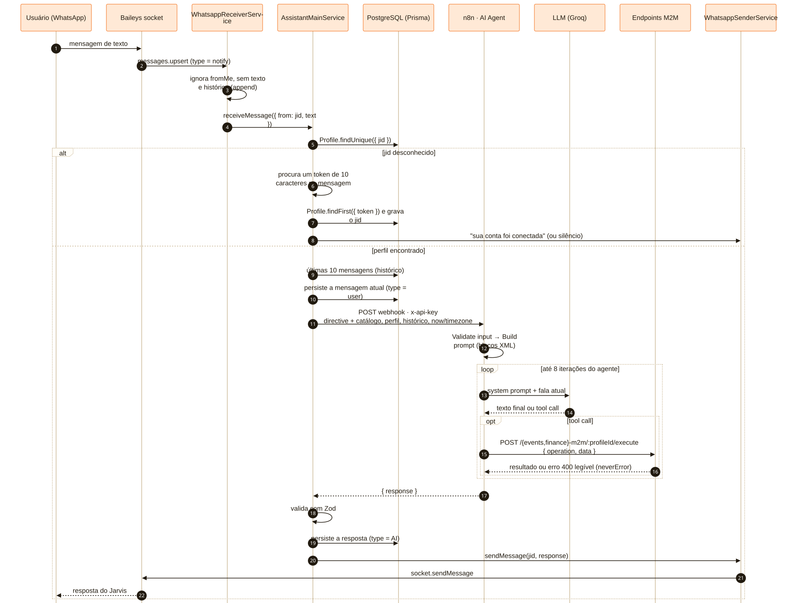
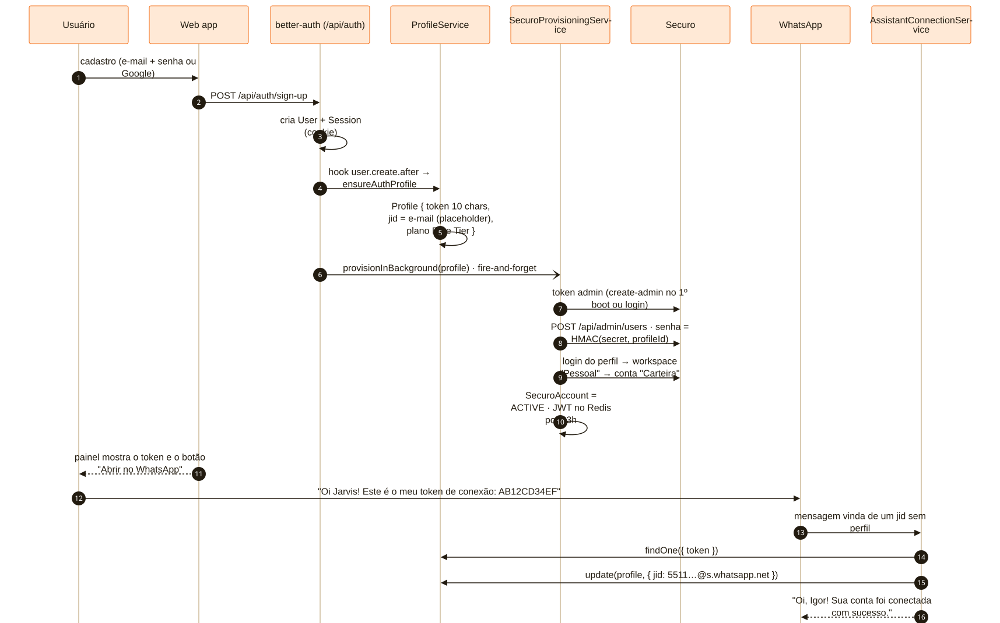

# Jarvis · Arquitetura e System Design

> Documento de referência da arquitetura do Jarvis, um assistente pessoal por WhatsApp com lembretes, rotinas, gestão financeira, painel web e API pública. Ele complementa o [README](README.md), que é o ponto de entrada rápido, e aprofunda cada visão, cada fluxo e cada decisão. Todos os diagramas têm fonte Mermaid em [`diagrams/src/`](diagrams/src/) e renders em SVG e PNG em [`diagrams/`](diagrams/).

## Sumário

1. [Objetivos e princípios de design](#1-objetivos-e-princípios-de-design)
2. [Visão de contexto](#2-visão-de-contexto)
3. [Visão de containers e deploy](#3-visão-de-containers-e-deploy)
4. [Visão de componentes do backend](#4-visão-de-componentes-do-backend)
5. [O loop de mensagens](#5-o-loop-de-mensagens)
6. [A camada de IA: n8n como orquestrador](#6-a-camada-de-ia-n8n-como-orquestrador)
7. [Identidade, onboarding e pareamento](#7-identidade-onboarding-e-pareamento)
8. [Gateway de WhatsApp](#8-gateway-de-whatsapp)
9. [Eventos: o motor de agendamento](#9-eventos-o-motor-de-agendamento)
10. [Finanças: o Securo como motor invisível](#10-finanças-o-securo-como-motor-invisível)
11. [API pública e chaves de API](#11-api-pública-e-chaves-de-api)
12. [Modelo de segurança](#12-modelo-de-segurança)
13. [Modelo de dados](#13-modelo-de-dados)
14. [Persistência e infraestrutura](#14-persistência-e-infraestrutura)
15. [Frontend](#15-frontend)
16. [Operação e observabilidade](#16-operação-e-observabilidade)
17. [Estratégia de testes](#17-estratégia-de-testes)
18. [Decisões de arquitetura e trade-offs](#18-decisões-de-arquitetura-e-trade-offs)
19. [Limitações conhecidas e evolução](#19-limitações-conhecidas-e-evolução)
20. [Glossário](#20-glossário)

---

## 1. Objetivos e princípios de design

O Jarvis nasceu de uma pergunta simples: *e se a interface do assistente fosse o aplicativo que a pessoa já abre cinquenta vezes por dia?* O WhatsApp é o canal, não um canal. Isso define quase tudo que vem depois: não existe chat na web, a latência percebida é a de uma conversa, e a resposta precisa caber em uma bolha de mensagem.

Cinco princípios guiaram as decisões e aparecem repetidamente ao longo deste documento:

| Princípio | O que significa na prática |
|---|---|
| **WhatsApp-first** | O core recebe e envia mensagens por um socket Baileys persistente. O painel web é complementar: onboarding, visualização e configuração. |
| **O modelo é um detalhe de implementação** | O backend não conhece nenhum SDK de LLM. Ele produz um contrato (prompt + catálogo de ferramentas + contexto) e consome outro (`{ response }`). Quem roda o modelo é o n8n. |
| **Contrato tipado entre humano, modelo e código** | Tudo que o modelo pode fazer está declarado em TypeScript, é validado por DTOs no backend e coberto por testes. Erros de validação são parte do protocolo, não exceções. |
| **Isolamento por usuário em todas as camadas** | `Profile` é a unidade de isolamento: histórico, eventos, chaves de API, e um usuário dedicado (com workspace próprio) no motor financeiro. O `profileId` vem sempre do servidor, nunca do cliente. |
| **Custo e simplicidade operacional** | Uma VPS, um `docker compose`, um banco gerenciado gratuito, um Redis. Cache para não martelar o banco, cron em vez de fila, sem Kubernetes. |

Números do repositório na data deste documento (10 de setembro de 2026):

| Métrica | Valor |
|---|---|
| Linhas de TypeScript no backend (sem testes) | ~6.400 |
| Linhas de testes no backend | ~1.600 |
| Linhas de TypeScript/TSX no frontend | ~7.000 |
| Suítes / testes unitários | 19 / 78 |
| Migrations Prisma | 10 |
| Módulos NestJS | 12 (mais 7 submódulos de finanças) |
| Operações disponíveis para o agente | 30 (3 de eventos, 27 financeiras) |
| Serviços no `compose.yml` | 10 |
| Commits | 271 |

---

## 2. Visão de contexto

<p align="center"></p>

O sistema tem dois tipos de usuário humano (a pessoa que conversa e a mesma pessoa usando o painel), um tipo de cliente máquina (sistemas do próprio usuário autenticados por API key) e quatro sistemas externos: os servidores do WhatsApp, o provedor de LLM (Groq), o banco gerenciado (Neon) e, num grau intermediário, o Securo e o n8n, que rodam na mesma VPS mas são processos com ciclo de vida próprio.

As fronteiras importantes:

- **Entre o usuário e o Jarvis** só existem dois caminhos: WhatsApp (mensagens) e HTTPS (painel). O painel nunca envia mensagens ao assistente; ele lê e edita dados.
- **Entre o Jarvis e a IA** o contrato é um webhook HTTP síncrono, protegido por chave, e um conjunto de callbacks HTTP também protegidos por chave. O n8n não acessa o banco.
- **Entre o Jarvis e o Securo** o contrato é a API REST do Securo, autenticada com JWT por usuário e cabeçalho de workspace. O Securo não sabe que o Jarvis existe; ele vê apenas usuários com e-mails `profile-<uuid>@jarvis.internal`.

---

## 3. Visão de containers e deploy

<p align="center"></p>

### 3.1 Serviços

| Serviço (`compose.yml`) | Imagem / build | Função | Depende de |
|---|---|---|---|
| `migrate` | `server/Dockerfile` (target `builder`) | `npx prisma migrate deploy` e termina. | — |
| `server` | `server/Dockerfile` (target `production`) | API NestJS, socket WhatsApp, scheduler. | `migrate` (exit 0), `redis` (healthy), `securo-backend` (started) |
| `web` | `web/Dockerfile` | nginx servindo o build estático do Vite. | `server` |
| `redis` | `redis:7-alpine` | Cache do Jarvis (db 0) e broker/cache do Securo (db 1). AOF ligado. | — |
| `securo-db` | `pgvector/pgvector:pg16` | Postgres do Securo, volume `securo-pgdata`. | — |
| `securo-migrate` | `securo/backend` | `alembic upgrade head` e termina. | `securo-db` (healthy), `redis` (healthy) |
| `securo-backend` | `securo/backend` | API FastAPI do Securo em `:8000`. | `securo-migrate` (exit 0) |
| `securo-celery-worker` | `securo/backend` | Jobs em background do Securo. | idem |
| `securo-celery-beat` | `securo/backend` | Agendador: materializa recorrências e aplica regras de ativos a cada hora. | idem |
| `n8n` | `docker.n8n.io/n8nio/n8n` (fora do compose) | Orquestrador do agente. Conectado à rede por `docker network connect`. | — |

### 3.2 Redes e exposição

Duas redes Docker:

- **`proxy`** (externa, pré-existente): só o Traefik, `web` e `server` participam. É por ela que o tráfego HTTPS chega.
- **`jarvis-internal`** (criada pelo compose): todos os serviços do Jarvis, o Securo e o n8n. Nenhum deles publica porta no host. A resolução de nomes do Docker (`http://server:3000`, `http://n8n:5678`, `http://securo-backend:8000`, `redis://redis:6379`) é a "service discovery".

O Traefik roteia por `Host()`: `FRONTEND_DOMAIN → web:80` e `API_DOMAIN → server:3000`, com TLS via Let's Encrypt. As labels ficam no próprio `compose.yml`.

O n8n é deliberadamente **não** exposto. Para editar workflows, o operador publica a porta apenas em `127.0.0.1` da VPS temporariamente e abre um túnel SSH (`ssh -N -L 5678:127.0.0.1:5678`). Depois, recria o container sem a porta. O volume `n8n_data` preserva credenciais e workflows entre essas recriações.

### 3.3 Ordem de subida e migrations

A ordem é imposta por `depends_on` com condições, não por scripts de espera:

```
securo-db (healthy) ──► securo-migrate (exit 0) ──► securo-backend ──┐
redis (healthy) ─────────────────────────────────────────────────────┼──► server ──► web
migrate (exit 0) ────────────────────────────────────────────────────┘
```

As migrations do Jarvis rodam num container separado (`migrate`) que usa o **mesmo build** do server (target `builder`, que tem o Prisma CLI e as devDependencies). O container de produção não carrega o CLI: ele copia apenas `dist/`, o client gerado (`node_modules/.prisma` e `@prisma`) e as dependências de runtime, e roda como usuário `node`.

### 3.4 Build das imagens

**Backend** (`server/Dockerfile`, `node:22-alpine`):

1. `builder`: `npm ci`, `prisma generate`, `nest build`.
2. `production`: `npm ci --omit=dev`, copia o client Prisma gerado e o `dist/` do builder. `CMD node dist/src/main.js`.

**Frontend** (`web/Dockerfile`):

1. `builder`: `npm ci`, recebe `VITE_API_URL` e `VITE_WHATSAPP_NUMBER` como build args (Vite embute em tempo de build), `npm run build`.
2. `production`: `nginx:alpine` com `nginx.conf` que faz fallback para `index.html` (SPA) e desliga o cache do `index.html` para que deploys apareçam imediatamente.

---

## 4. Visão de componentes do backend

<p align="center"></p>

### 4.1 Módulos e responsabilidades

| Módulo | Responsabilidade | Principais peças |
|---|---|---|
| `PrismaModule` (global) | Conexão com o Postgres via driver adapter. | `PrismaService extends PrismaClient` com `PrismaPg`. |
| `RedisModule` (global) | Cliente Redis único, conectado no boot. | `RedisService.getClient()`. |
| `AuthModule` | Instância do better-auth, sessão, hooks de criação de usuário. | `BetterAuthService` (`instance`, `getSession`, `requireSession`). |
| `ProfileModule` | O `Profile`: criação a partir do usuário autenticado, token de pareamento, view para a web. | `ProfileService.ensureAuthProfile`, `toProfileMeView`. |
| `SubscriptionModule` | Planos. Garante o Free Tier. | `SubscriptionService.ensureDefaultSubscription`. |
| `MessagesModule` | Histórico de conversa por perfil. | `MessagesService.findAll({ userId, take })`. |
| `WhatsappModule` | Socket Baileys, recepção, envio, credenciais cifradas, guard administrativo. | `WhatsappConnectionService`, `WhatsappReceiverService`, `WhatsappSenderService`, `BaileysAuthStore`, `WhatsappAuthCryptoService`, `WhatsappAdminGuard`. |
| `AssistantModule` | O loop de mensagens, o prompt, o catálogo de ferramentas, o cliente do n8n e o pareamento. | `AssistantMainService`, `AssistantWorkflowService`, `AssistantConnectionService`, `ASSISTANT_TOOLS`, `buildDirective`. |
| `EventsModule` | Séries e execuções, scheduler, endpoints M2M e web. | `EventsSchedule` (`@Cron`), `EventsM2mService`, `EventSeriesService`, `EventExecutionService`. |
| `FinanceModule` | Cliente do Securo, provisioning, contexto por perfil, 7 submódulos de domínio, fachada M2M. | `SecuroApiService`, `SecuroProvisioningService`, `SecuroContextService`, `FinanceM2mController`, `*Service` por área. |
| `ApiKeysModule` | Ciclo de vida das chaves e o guard de API key. | `ApiKeysService`, `ApiKeyGuard`, `@ApiKeyProfile()`. |
| `PublicApiModule` | Rotas públicas `/v1/*`. | `PublicApiController`, `PublicApiService`. |

### 4.2 Dependências e o ciclo WhatsApp ⇄ Assistant

O grafo tem uma dependência circular legítima: o `WhatsappModule` precisa do `AssistantMainService` (para entregar mensagens recebidas) e o `AssistantModule` precisa do `WhatsappSenderService` (para responder). Ela é resolvida com `forwardRef()` nos dois lados e, dentro do `WhatsappSenderService`, com `@Inject(forwardRef(() => WhatsappConnectionService))`.

Os outros `forwardRef` (`Auth ⇄ Profile`, `Auth → Finance`) existem porque o hook de criação de usuário do better-auth precisa do `ProfileService` e do `SecuroProvisioningService`, enquanto os controllers desses módulos precisam do `BetterAuthService` para validar sessão.

### 4.3 Convenções que sustentam a modularidade

- Cada módulo segue `controllers/ services/ dto/ entities/ utils/ schedules/ tests/`. Testes ficam colocados no módulo (`rootDir` do Jest é `src`).
- **Duas fachadas por capacidade.** Eventos e finanças expõem um controller M2M (`/*-m2m/:profileId/execute`, guard administrativo, `profileId` na rota) e um controller web (`/*/me/*`, sessão, `profileId` resolvido da sessão). Ambos chamam os mesmos services.
- **RPC nos M2M.** Em vez de um endpoint REST por operação, os M2M recebem `{ operation, data }` (`ExecuteOperationDto`) e fazem `switch` para o DTO certo, validando com `validateDto()` (`plainToInstance` + `validateOrReject`). Isso reduziu dezenas de nós no n8n a quatro.
- **Validação em duas famílias.** DTOs internos usam class-validator (integrados ao `ValidationPipe` global com `whitelist`, `forbidNonWhitelisted`, `transform`). Payloads externos (a resposta do n8n, as respostas críticas do Securo) usam Zod. A regra: *o que entra de fora é parseado, o que trafega dentro é declarado.*
- **Idioma.** Strings para o usuário, prompts e docs de módulo em pt-BR; identificadores, comentários novos e commits em inglês.

---

## 5. O loop de mensagens

<p align="center"></p>

Este é o caminho crítico do produto. Cada etapa abaixo cita o componente responsável.

### 5.1 Recepção

`WhatsappConnectionService` registra, no boot, o handler `messages.upsert` do Baileys apontando para `WhatsappReceiverService.handleMessagesUpsert`. O receiver aplica três filtros:

1. `type === 'notify'`. O Baileys também emite `append` para histórico sincronizado; ignorá-lo evita reprocessar conversas antigas quando a sessão reconecta.
2. `!message.key.fromMe`. Mensagens enviadas pelo próprio número do assistente (inclusive as respostas do Jarvis) não voltam para o loop.
3. Presença de texto. O receiver extrai `conversation`, `extendedTextMessage.text` ou a legenda de imagem/vídeo/documento. Sem texto, a mensagem é descartada.

O receiver não valida nem decide nada além disso; ele normaliza para `IncomingMessageDto` e chama `AssistantMainService.receiveMessage` sem aguardar (`void`), para nunca bloquear o event loop do socket.

### 5.2 Resolução do perfil

`ProfileService.findOne({ jid })` faz um `findUnique` pelo `jid` (único no schema). Dois caminhos:

- **Sem perfil**: `AssistantConnectionService.connectionAttempt` procura um token com a regex `\b[A-Za-z0-9]{10}\b`. Se existir um `Profile` com aquele `token`, o `jid` do remetente é gravado nele e o Jarvis responde confirmando. Qualquer outra mensagem de um número desconhecido é ignorada com um `warn` no log. Não há resposta para desconhecidos, de propósito: evita virar um bot que responde a qualquer número.
- **Com perfil**: segue o loop.

### 5.3 Contexto e persistência

O histórico (`MessagesService.findAll`, 10 mais recentes, ordem decrescente) é carregado **antes** de persistir a mensagem atual, para que ela não apareça duplicada em `lastMessages` e `currentMessage`. O histórico é reduzido a `{ type, content, createdAt }`.

A mensagem atual é gravada como `type = user`. A tabela `messages` usa `userId` para guardar o `profile.id` (nome legado; não há FK).

### 5.4 O payload para o n8n

`ReceiveMessageWorkflowInput`:

| Campo | Origem | Observação |
|---|---|---|
| `directive` | `buildDirective(ASSISTANT_TOOLS)` | Prompt estático + referência de ferramentas renderizada. Calculado **uma vez por processo** (constante de módulo). |
| `profileId` | `profile.id` | Vai para a rota dos M2M. |
| `profileContext` | `profile.about` | Texto livre que o usuário edita no perfil ("sou dev, moro em SP, tenho dois filhos..."). |
| `currentMessage` | texto recebido | |
| `lastMessages` | histórico | Mais recente primeiro. |
| `tools` | `ASSISTANT_TOOLS` | O catálogo bruto, para consumidores que queiram montar tools dinamicamente. O workflow atual usa a versão renderizada em `directive`. |
| `now`, `nowHuman`, `timezone` | `buildTemporalContext(profile.timezone)` | `2026-09-10T14:30:00-03:00` e `quinta-feira, 10 de setembro de 2026 às 14:30`. Fuso inválido cai para `America/Sao_Paulo`. |

`AssistantWorkflowService.fetch` faz `POST` com `x-api-key: ASSISTANT_WORKFLOW_KEY`, lança em status não-2xx e parseia a resposta com `ReceiveMessageWorkflowOutputSchema = z.object({ response: z.string() })`.

### 5.5 Resposta

A resposta é gravada como `type = AI` e enviada por `WhatsappSenderService.sendMessage(jid, text)`. O sender lança `503 ServiceUnavailable` se o socket não está conectado e `500` se o envio falha; `AssistantMainService` captura tudo num `try/catch` único, loga e devolve `{ ok: false, error }`. Não há retry: uma falha de rede no n8n resulta em silêncio para o usuário, que naturalmente reenvia.

### 5.6 Propriedades do loop

- **Stateless por mensagem.** Todo o contexto vem do banco a cada mensagem. Reiniciar o server não perde conversa.
- **Idempotência não garantida.** Se o Baileys reentregar a mesma mensagem, ela seria processada de novo. Na prática o filtro `notify` e o `fromMe` cobrem os casos observados.
- **Latência.** Dominada pelo modelo (1 a 3 iterações típicas) e pelos callbacks HTTP. O backend adiciona duas leituras e duas escritas no Postgres.

---

## 6. A camada de IA: n8n como orquestrador

<p align="center"></p>

### 6.1 Por que n8n

Rodar o modelo dentro do NestJS seria mais direto. A escolha pelo n8n foi deliberada por três razões:

1. **Troca de modelo sem deploy.** O nó `Groq Chat Model` pode ser substituído por OpenAI, Anthropic, Ollama ou qualquer outro com function calling, editando o workflow. O contrato com o backend não muda.
2. **Observabilidade do agente de graça.** Cada execução no n8n mostra o prompt montado, cada tool call, cada resposta do backend e o texto final. Depurar comportamento do modelo vira olhar uma tela, não instrumentar código.
3. **Separação de responsabilidades.** O backend é dono do *contrato* (o que o agente pode fazer, com que dados, sob que regras). O n8n é dono da *execução* (qual modelo, com que temperatura, quantas iterações).

O custo é um salto de rede a mais por mensagem e a dependência de um serviço adicional. A seção 18 discute a alternativa.

### 6.2 O workflow

O arquivo [`n8n.json`](../n8n.json) é versionado e importável. Nós, em ordem:

| Nó | Tipo | O que faz |
|---|---|---|
| **Webhook** | `webhook` v2.1, `POST /webhook/assistant`, Header Auth | Recebe o payload. Responde pelo nó *Respond to Webhook* (`responseMode: responseNode`). |
| **Validate input** | `code` | Checa tipos dos campos obrigatórios e normaliza defaults. Produz `valid: boolean`. |
| **If** | `if` | `valid` → *Build prompt*; senão → *Respond invalid* (`"Não foi possível processar a mensagem agora."`). |
| **Build prompt** | `code` | Ordena o histórico por `createdAt`, escapa `<` e `>` do conteúdo do usuário (troca por `‹` `›`), e concatena: `directive` + `# Contexto desta conversa` com `<data_e_hora_atual>`, `<perfil_do_usuario>`, `<historico_recente>` + `# Lembrete final`. |
| **AI Agent** | `@n8n/n8n-nodes-langchain.agent` v3.1 | `text = currentMessage`, `systemMessage = systemPrompt`, `maxIterations = 8`, `onError: continueRegularOutput`. |
| **Groq Chat Model** | `lmChatGroq` | `openai/gpt-oss-120b`, `temperature 0.2`. |
| **create_event**, **find_active_events**, **delete_event** | `httpRequestTool` v4.2 | Uma tool por operação de eventos, com parâmetros tipados via `$fromAI(...)`. |
| **finance** | `httpRequestTool` v4.2 | Uma tool única com `operation` (string) e `data` (JSON serializado em string). |
| **Format response** | `code` | Pega `output` (ou `text`), faz `trim`, e cai num texto de desculpas se vier vazio. |
| **Respond to Webhook** | `respondToWebhook` | `{ response }`. |

Todas as tools apontam para `http://server:3000/...` (nome de serviço na rede interna), usam a credencial Header Auth e têm `neverError: true`, o que faz um `400` do backend virar *resultado* da tool em vez de erro do workflow. É esse detalhe que fecha o laço de correção: o modelo lê `"recurrenceMode must be one of HOUR, DAY, WEEK, MONTH"` e tenta de novo.

### 6.3 O system prompt em camadas

O prompt final tem três autores e é montado em três momentos:

```
┌──────────────────────────────────────────────────────────────┐
│ 1. DEFAULT_DIRECTIVE           (backend, estático, versionado)│
│    # Papel e objetivo                                         │
│    # Instruções (conversa, quando usar tools, dados           │
│      obrigatórios, depois da tool, datas e valores)           │
│    # Como raciocinar antes de responder                       │
│    # Formato da resposta                                      │
│    # Exemplos                                                 │
├──────────────────────────────────────────────────────────────┤
│ 2. renderToolsReference(ASSISTANT_TOOLS)  (backend, por boot) │
│    # Ferramentas disponíveis                                  │
│    ## Módulo events: ...    (uma tool por operação)           │
│    ### create_event · Quando usar · Campos · Exemplo · Obs.   │
│    ## Módulo finance: ...   (tool única "finance")            │
│    ### list_accounts ... ### delete_asset (27 operações)      │
├──────────────────────────────────────────────────────────────┤
│ 3. Contexto desta conversa            (n8n, por mensagem)     │
│    <data_e_hora_atual> ... </data_e_hora_atual>               │
│    <perfil_do_usuario> ... </perfil_do_usuario>               │
│    <historico_recente> <mensagem autor="usuario">...          │
│    # Lembrete final                                           │
└──────────────────────────────────────────────────────────────┘
```

A estrutura segue o esqueleto recomendado pelo guia de prompting do GPT-4.1 e incorpora os três "lembretes agênticos" (persistência, uso de ferramentas sem inventar dados, planejamento antes de cada chamada). Instruções essenciais aparecem no início e no fim (a técnica de *sandwich* para contextos longos). Markdown delimita instruções, XML delimita contexto e dados; JSON não é usado como conteúdo de prompt. O histórico é apresentado como demonstração implícita, por isso o escape de tags: uma mensagem do usuário nunca consegue fechar `</historico_recente>` e injetar instruções.

O `ASSISTANT.md` na raiz documenta o diagnóstico que levou a este desenho (o agente respondia "significado de bom dia" porque recebia um JSON de configuração como fala do usuário e tinha tools sem descrição e sem parâmetros) e cada técnica aplicada, com referências.

### 6.4 O catálogo de ferramentas como contrato

`assistant/tools/*.ts` declara `AssistantTool → AssistantToolEndpoint → AssistantToolOperation`:

```ts
{
  name: 'create_event',
  whenToUse: 'Criar um lembrete único ("me lembra amanhã às 9h de...") ou uma rotina recorrente ...',
  params: [
    'type (string, obrigatório): "UNIQUE" para um único envio ou "RECURRENCE" para repetição.',
    'startAt (string, obrigatório): data e hora ... em ISO-8601 com offset ... arredondado para 10 minutos.',
    ...
  ],
  example: { type: 'RECURRENCE', startAt: '2026-09-11T08:00:00-03:00', content: '...', recurrenceInterval: 1, recurrenceMode: 'DAY' },
  notes: 'Nunca envie recurrenceInterval ou recurrenceMode em eventos UNIQUE. ...',
}
```

Duas estratégias de exposição, escolhidas por módulo com o campo `rpcToolName`:

| Estratégia | Onde | Por quê |
|---|---|---|
| **Uma tool por operação, campos tipados** | events (3 operações) | O modelo vê um JSON Schema real para cada função e erra muito menos em campos e enums. Poucas operações, vale o nó extra no n8n. |
| **Tool única RPC (`operation` + `data`)** | finance (27 operações) | Trinta nós no n8n seriam inviáveis de manter. A precisão vem da referência detalhada no prompt e do feedback de validação do backend. `data` vai como string JSON porque o tipo `json` do `$fromAI` rejeita objetos vazios, e várias operações não têm parâmetros. |

O backend aceita `data` como objeto ou string (`ExecuteOperationDto` faz o parse com `@Transform`), e uma string inválida produz um `400` legível pelo modelo. `main.tools.spec.ts` garante que todo módulo aponta para `/*-m2m/:profileId` e que a forma do catálogo não regrediu.

### 6.5 Regras de comportamento do agente

Do prompt, as que mais influenciam a experiência:

- Cumprimento é cumprimento, não texto para analisar. O primeiro exemplo do prompt é exatamente `bom dia`.
- Um pedido claro de ação é autorização suficiente. Confirmação só antes de excluir ou quando há ambiguidade real.
- Se faltar um campo obrigatório, **não chama a ferramenta**: faz uma única pergunta objetiva.
- Se a ação depende de uma consulta (achar o id de um lembrete para cancelar), faz as duas na mesma rodada.
- Nunca menciona `profileId`, nomes de tools, JSON ou erros técnicos.
- Formato WhatsApp: 1 a 4 linhas, sem títulos, sem tabelas, `*negrito*` com moderação.

---

## 7. Identidade, onboarding e pareamento

<p align="center"></p>

### 7.1 better-auth fora do pipeline do Nest

`main.ts` cria o app com `bodyParser: false`, registra `toNodeHandler(authService.instance)` em `/api/auth` e **só depois** monta `express.json()` e `express.urlencoded()`. O better-auth precisa ler o corpo bruto; um parser global antes dele quebraria login e cadastro. Essa ordem é a única coisa "frágil" do bootstrap e está documentada no código e no `CLAUDE.md`.

Configuração relevante do `BetterAuthService`:

- `prismaAdapter` sobre o mesmo `PrismaService` (tabelas `user`, `session`, `account`, `verification`).
- E-mail/senha com `minPasswordLength: 8`, `autoSignIn`. Google opcional, ligado só se `GOOGLE_CLIENT_ID/SECRET` existem; `accountLinking` habilitado.
- `trustedOrigins: [WEB_ORIGIN]` e CORS com `credentials: true` no Nest, para o cookie de sessão funcionar entre `app.` e `api.`.
- `sendResetPassword` apenas **loga** a URL (não há provedor de e-mail).

Não existe guard global de sessão. Cada controller web chama `BetterAuthService.requireSession(request.headers)` explicitamente e, em seguida, `ProfileService.ensureAuthProfile(session.user)`. A escolha por chamadas explícitas em vez de um guard mantém o `main.ts` simples e deixa visível, em cada handler, que ele é autenticado.

### 7.2 O Profile nasce no hook

`databaseHooks.user.create.after` chama `ProfileService.ensureAuthProfile(user)`, que cria:

```
Profile {
  userId:          user.id
  name:            user.name ou a parte local do e-mail
  token:           10 caracteres [A-Z0-9], gerados com randomBytes
  jid:             user.email          ← placeholder, único
  about:           ''
  timezone:        'America/Sao_Paulo'
  subscriptionId:  Free Tier (criado se não existir)
}
```

e, em seguida, dispara `SecuroProvisioningService.provisionInBackground(profile)` sem `await`. O cadastro nunca espera nem falha por causa do Securo.

`ensureAuthProfile` é idempotente e é chamado em todo endpoint web autenticado. Isso cobre usuários criados antes do hook existir e torna o sistema autocorretivo.

### 7.3 Pareamento pelo WhatsApp

O `jid` provisório (o e-mail) satisfaz a constraint de unicidade sem colidir com números reais. O painel mostra o token e, se `VITE_WHATSAPP_NUMBER` estiver configurado, um botão `wa.me/<número>?text=Oi Jarvis! Este é o meu token de conexão: <token>`.

Quando uma mensagem chega de um `jid` desconhecido, `AssistantConnectionService` procura o token e, ao encontrar, sobrescreve o `jid` do perfil pelo `jid` real (`5511999999999@s.whatsapp.net`). `isWhatsappLinked(profile)` é simplesmente `jid.endsWith('@s.whatsapp.net')`, e a view `/profile/me` devolve o número mascarado (`5511*******99`).

Trocar de número é enviar o mesmo token do novo número: o `jid` é sobrescrito de novo.

### 7.4 Planos

`Subscription { name, price, limit }` com o Free Tier (`limit: 100`) criado sob demanda. O painel exibe os planos (`GET /subscriptions`) e o plano atual; a troca de plano e a aplicação do limite ainda não existem (seção 19).

---

## 8. Gateway de WhatsApp

### 8.1 Uma sessão para toda a plataforma

O Jarvis usa **um único número** de WhatsApp. O multi-tenant acontece no mapeamento `jid → Profile`. O `WhatsappConnectionService` é um singleton `OnModuleInit` que abre o socket Baileys no boot e o mantém vivo pelo tempo de vida do processo.

### 8.2 Ciclo de vida da conexão

```
boot ──► connect()
          ├─ createAuthenticationState()  (carrega creds cifradas do Postgres)
          ├─ makeWASocket({ auth, printQRInTerminal: false, logger: silent })
          └─ handlers: creds.update, connection.update, messages.upsert

connection.update
  ├─ qr           → guarda o QR (exposto em GET /whatsapp/qr como data URL PNG)
  ├─ open         → connected = true, QR limpo
  └─ close
       ├─ loggedOut → clearAuth() (apaga whatsapp_auth) e reconecta (vai gerar QR novo)
       └─ outros    → reconecta após 3 s (flag reconnecting evita corrida)

onModuleDestroy → shuttingDown = true, fecha o socket sem reconectar
```

O Baileys é importado dinamicamente (`await import('@whiskeysockets/baileys')`) porque o pacote é ESM e o backend compila para CommonJS.

### 8.3 Credenciais cifradas no banco

O Baileys espera um `AuthenticationState` com `creds` e um `keys` store (`get`/`set` por tipo e id). `BaileysAuthStore` implementa isso sobre a tabela `whatsapp_auth (key, value json)`:

- `creds` fica na chave literal `creds`; as chaves de sinal ficam em `<tipo>:<id>` (ex. `pre-key:12`, `session:5511…`).
- Todo `value` passa por `WhatsappAuthCryptoService.encrypt` antes de ir para o banco: **AES-256-GCM**, IV aleatório de 12 bytes, auth tag, tudo em base64 num envelope `{ version: 1, algorithm, iv, authTag, ciphertext }`. A chave vem de `WHATSAPP_AUTH_ENCRYPTION_KEY` (32 bytes em base64, validado no construtor).
- Serialização usa `BufferJSON.replacer/reviver` do Baileys para preservar `Buffer`s, e `app-state-sync-key` é reidratado via protobuf.

Consequências: um dump do banco não expõe a sessão do WhatsApp; perder a chave de cifra obriga a escanear o QR de novo, mas não expõe nada.

### 8.4 Envio

`WhatsappSenderService.sendMessage(jid, text)` é o único ponto de saída, usado pelo loop de mensagens, pelo scheduler de eventos, pela API pública e pelo endpoint administrativo `POST /whatsapp/send`. Ele falha rápido (`503`) se o socket não está `open`.

### 8.5 Endpoints administrativos

`/whatsapp/qr`, `/whatsapp/status` e `/whatsapp/send` ficam atrás do `WhatsappAdminGuard`. O guard aceita a chave em `x-admin-key`, `x-whatsapp-admin-key`, `x-api-key` ou `Authorization: Bearer`, e compara com `timingSafeEqual` após checar o tamanho. O mesmo guard protege os controllers M2M, o que permite que a credencial Header Auth do n8n (que envia `x-api-key`) seja reutilizada.

---

## 9. Eventos: o motor de agendamento

### 9.1 Modelo em duas tabelas

| `EventSeries` (a regra) | `EventExecution` (o disparo) |
|---|---|
| `type: UNIQUE \| RECURRENCE` | `scheduledAt` (UTC, múltiplo de 10 min) |
| `startAt` | `content` (o texto que será enviado) |
| `recurrenceInterval`, `recurrenceMode: HOUR \| DAY \| WEEK \| MONTH` | `status: PENDING → PROCESSING → COMPLETED \| FAILED \| CANCELLED` |
| `active` | `observabilitys` (motivo da falha) |
| `profileId` | `@@unique([eventSeriesId, scheduledAt])`, `@@index([status, scheduledAt])` |

Separar regra de disparo permite que uma rotina tenha histórico (cada envio é uma linha com seu próprio estado), que cancelar seja desativar a série e marcar as pendentes, e que a próxima ocorrência seja gerada *depois* que a anterior terminou, sem gerar ocorrências infinitas antecipadamente.

O fuso horário fica no `Profile`, não na série. "Todo dia às 8h" significa 8h no fuso do usuário mesmo em mudanças de horário de verão, e mudar o fuso no perfil afeta as próximas ocorrências de todas as séries.

<p align="center"></p>

### 9.2 Normalização para 10 minutos

`normalizeScheduledAt` arredonda qualquer instante para o múltiplo de 10 minutos mais próximo dentro da hora, com empate (xx:x5:00) arredondando **para frente**. Isso alinha todo disparo ao tick do cron: se o usuário pede 9:03, o lembrete sai às 9:00; se pede 9:07, às 9:10. O prompt avisa o modelo dessa regra e a confirmação ao usuário usa o horário já arredondado.

`getNextScheduledAt(scheduledAt, mode, interval, timezone)` converte para o fuso do perfil, soma `interval` unidades de `mode` com Luxon (que lida com meses de tamanhos diferentes e DST), normaliza, e **repete enquanto o resultado não for estritamente futuro**. Isso importa quando o server ficou fora do ar: uma rotina diária não gera 5 execuções atrasadas; ela pula para a próxima ocorrência válida.

### 9.3 O tick do scheduler

<p align="center"></p>

`EventsSchedule.processDueEvents` roda com `@Cron(EVERY_10_MINUTES)`:

1. **Cache de janela no Redis.** A chave `events:schedule:pending-cache` guarda `[{ id, scheduledAt }]` das execuções `PENDING` de séries ativas com `scheduledAt ≤ agora + 2h`, com TTL de 2h. Se a chave existe, o banco **não é consultado** neste tick. Se não existe, uma única query a repopula. Na prática, o Postgres é lido uma vez a cada 2 horas, e não a cada 10 minutos.
2. **Seleção dos vencidos** em memória (`scheduledAt ≤ agora`). Se não há nenhum, o tick termina sem tocar em nada.
3. **Reescrita do cache** só com os futuros, preservando o TTL (`KEEPTTL`), para que um vencido nunca seja processado duas vezes.
4. **Claim atômico.** Carrega as execuções por id (com série e perfil) e faz `updateMany({ id IN ids, status: PENDING, série ativa }) → PROCESSING`. O predicado `status: PENDING` no `WHERE` garante que só quem ainda estava pendente é reservado.
5. **Envio sequencial.** Para cada execução: `sendMessage(profile.jid, content)`; sucesso → `COMPLETED`, erro → `FAILED` com a mensagem em `observabilitys`.
6. **Próxima ocorrência.** `UNIQUE` → desativa a série. `RECURRENCE` → calcula o próximo instante e faz `INSERT`; um `P2002` (violação da unique) é capturado e ignorado, porque significa que aquela ocorrência já existe.

### 9.4 Invalidação do cache

`EventsM2mService.createEvent` compara o `startAt` normalizado com `agora + 2h`: se cair na janela, faz `DEL` da chave. O próximo tick repopula e enxerga o evento novo. Eventos fora da janela entram naturalmente na próxima repopulação. `deleteEvent` não invalida: as execuções canceladas são filtradas no `findManyByIdsForProcessing` (que exige `status: PENDING` e série ativa), então um id cancelado que ainda está no cache simplesmente não é reservado.

### 9.5 Endpoints

| Rota | Auth | Operações |
|---|---|---|
| `POST /events-m2m/:profileId/execute` | admin key | `create_event`, `find_active_events` (filtros `scheduledAt=YYYY-MM-DD` no fuso do perfil, `type`), `delete_event`, `get_guideline` |
| `GET /events/me` | sessão | Execuções `PENDING`/`PROCESSING` de séries ativas do perfil logado |
| `DELETE /events/me/series/:id` | sessão | Desativa a série se ela pertencer ao perfil (`404` caso contrário, sem revelar existência) |

### 9.6 Trade-offs assumidos

- **Sem retentativa.** Um `FAILED` é final. A alternativa (fila com backoff) foi adiada porque a causa típica de falha é o socket desconectado, e nesse caso reenviar 10 minutos depois raramente resolveria. O motivo fica registrado para diagnóstico.
- **Processo único.** O claim protege contra reprocessamento dentro do processo e entre reinícios, mas duas instâncias rodando o cron simultaneamente poderiam ler o mesmo cache. Como a sessão Baileys já é singleton, o server é uma instância por desenho.
- **Granularidade de 10 minutos.** Suficiente para lembretes pessoais; inaceitável para alarmes. O produto é o primeiro.

---

## 10. Finanças: o Securo como motor invisível

### 10.1 Por que vendorizar um gestor financeiro

Construir contas, transações, categorias, regras, metas, recorrências e investimentos do zero seria o maior módulo do projeto. O [Securo](https://docs.usesecuro.com/docs) já resolve tudo isso com um modelo de dados maduro, API REST, multi-workspace e um Celery Beat que materializa recorrências (salário no dia 5, assinatura no dia 10) sem que o Jarvis precise de mais um scheduler. O frontend do Securo não é usado; o Jarvis é a única interface.

### 10.2 Um usuário do Securo por perfil

<p align="center"></p>

Cada `Profile` tem um `SecuroAccount` (1:1) com `email`, `securoUserId`, `workspaceId`, `defaultAccountId` e `status: PENDING | ACTIVE | FAILED`. A criação:

1. **Credenciais determinísticas.** `email = profile-<profileId>@jarvis.internal`, `senha = HMAC-SHA256(SECURO_PROVISION_SECRET, profileId)`. Nenhuma senha é armazenada; qualquer instância do backend com o mesmo segredo consegue logar como qualquer perfil. Trocar o segredo invalida todas as senhas (por isso o aviso na tabela de variáveis).
2. **Admin de serviço.** No primeiro contato com uma instância vazia (`GET /api/setup/status → has_users: false`), o backend chama `POST /api/setup/create-admin` com `SECURO_ADMIN_*`, moeda BRL e idioma pt-BR. Depois disso, é login normal. O token admin é cacheado no Redis.
3. **Criação via admin.** `POST /api/admin/users` (o registro público do Securo tem rate limit de 3 por hora por IP, inviável para um servidor). O Securo cria sozinho o workspace "Pessoal", a conta "Carteira", 16 categorias em pt-BR e regras universais. Um `already exists` é tratado como sucesso (reprovisioning).
4. **Descoberta.** Login como o perfil, `GET /api/workspaces` (pega o primeiro), `GET /api/accounts` (pega o primeiro ou cria "Carteira"). Tudo gravado, status `ACTIVE`.

Qualquer falha marca `FAILED` com o motivo em `observabilitys` e **não** lança para quem chamou o cadastro. Na próxima operação financeira, `SecuroContextService.contextFor(profileId)` chama `ensureSecuroAccount` de novo, que só faz curto-circuito se o status for `ACTIVE` com ids preenchidos. É o mecanismo de autocorreção: um Securo fora do ar na hora do cadastro se resolve sozinho no primeiro "gastei 50 no mercado".

### 10.3 Tokens e cache

O Securo emite JWTs de 24h sem refresh, e o login tem rate limit de 5 por minuto por IP. Os tokens (admin e por perfil) são cacheados no Redis por **23h** (`finance:securo:user-token:<profileId>`, `finance:securo:admin-token`). Cada perfil loga no máximo uma vez por dia. Toda chamada de domínio leva `Authorization: Bearer` e `X-Workspace-Id`.

### 10.4 Tradução de contratos

`SecuroApiService` é o cliente HTTP mínimo (`fetch`, query string, form ou JSON, cabeçalhos) e traduz erros: `400/409/422 → BadRequestException` com o `detail` do Securo, `404 → NotFoundException`, resto → `Error`. Como o `detail` chega ao modelo via `neverError`, a validação do Securo também participa do laço de correção.

Os services de domínio (`AccountsService`, `TransactionsService`, ...) aplicam as regras de tradução, todas cobertas por testes:

| Regra | Motivo |
|---|---|
| Valores sempre positivos; direção em `type: debit \| credit` | O Securo não valida esses enums (string livre). Os DTOs validam com `@IsIn` antes de enviar. |
| Dinheiro como string com 2 casas (`"50.00"`) | O Securo usa `Numeric(15,2)`; evita ruído de float. |
| Datas `YYYY-MM-DD` sem hora | Modelo do Securo. |
| `camelCase → snake_case`, campos `undefined` omitidos | `PATCH` do Securo é `exclude_unset`: omitido significa "não mexe". |
| `accountId` omitido → `defaultAccountId` ("Carteira") | O usuário raramente diz de qual conta saiu o dinheiro. |
| Moeda default BRL; em transações, a moeda da conta | |
| Enums (tipos de conta, frequências, tipos de ativo, operadores de regra) centralizados em `securo-vocab.constant.ts` | Fonte única para DTOs e para o catálogo de tools. |

### 10.5 Duas fachadas, um serviço

| Fachada | Rota | Auth | Quem usa |
|---|---|---|---|
| M2M (RPC) | `POST /finance-m2m/:profileId/execute` com `{ operation, data }` | admin key | n8n |
| Web (REST) | `/finance/me/accounts`, `/finance/me/transactions[/:id]`, `/finance/me/categories`, `/rules`, `/goals`, `/recurring-transactions`, `/assets[/:id/values|trades]` | sessão | frontend |

As 27 operações do RPC mapeiam 1:1 para os métodos dos services. `GET .../transactions` aceita `from`, `to`, `type`, `categoryId`, `accountId`, `q`, `page`, `limit` e devolve o envelope do Securo `{ items, total, page, limit, summary: { income, expense, net } }`. O `summary` é o que responde "quanto gastei esse mês" sem somar no cliente.

Decisões de segurança de produto: o endpoint destrutivo `apply-all` de regras do Securo não foi exposto; metas têm progresso manual (o modelo consulta e soma); vender mais unidades de um ativo do que se tem é rejeitado pelo próprio Securo (`422`).

---

## 11. API pública e chaves de API

### 11.1 Chaves

`ApiKey { profileId, name, prefix, hash, active, lastUsedAt }`. Geração:

```
secret = 'jrv_' + base64url(randomBytes(24))          // ex. jrv_k9Xw...  (36 chars)
prefix = secret.slice(0, 12)                          // jrv_k9Xw1a2b   (exibido na UI)
hash   = sha256(secret)                               // única coisa persistida do segredo
```

O `secret` é devolvido **uma única vez** na resposta do `POST /api-keys/me`. Limite de 10 chaves por perfil. `active: false` pausa sem apagar. `lastUsedAt` é atualizado a cada uso de forma best-effort (a promessa não é aguardada e erros são engolidos), para nunca adicionar latência ou falha à requisição do cliente.

### 11.2 Guard

`ApiKeyGuard` lê `Authorization: Bearer <chave>` (preferido) ou `x-api-key`, rejeita cedo o que não parece uma chave (`looksLikeApiKey`), calcula o hash, busca `ApiKey` + `Profile` por `hash` (coluna `@unique`, índice por construção) e recusa com `401` se a chave não existe, está inativa ou o perfil está inativo. Ao passar, grava `request.apiKeyProfile`, exposto por `@ApiKeyProfile()`.

### 11.3 Superfície pública

Tudo vive em `/v1` com `@UseGuards(ApiKeyGuard)` na classe. Hoje: `POST /v1/messages { message }` envia texto para o WhatsApp **do dono da chave** (`409` se ainda não pareou, `503` se o socket está fora). O cliente nunca informa destinatário: uma chave só consegue falar com quem a criou, o que elimina spam por design.

Adicionar um endpoint público é: DTO em `dto/`, método no service, rota no controller, documentar no README do módulo e na página `/configuracoes/documentacao` do frontend.

---

## 12. Modelo de segurança

<p align="center"></p>

### 12.1 Três públicos, três mecanismos

| Público | Mecanismo | Onde | Propriedades |
|---|---|---|---|
| Pessoa no navegador | Cookie de sessão do better-auth | `/api/auth/*`, `/profile/me`, `/events/me`, `/finance/me/*`, `/api-keys/me*`, `/subscriptions` | `requireSession` explícito em cada handler; `profileId` sempre derivado da sessão; recursos de outro perfil respondem `404`, não `403`. |
| Sistema do usuário | API key `jrv_…` | `/v1/*` | Hash SHA-256, exibida uma vez, revogável, escopo implícito (só o dono). |
| Serviços internos (n8n, operador) | Chave administrativa estática | `/events-m2m/*`, `/finance-m2m/*`, `/whatsapp/*` | `timingSafeEqual`; **e** rede privada sem porta publicada. Duas camadas: a chave protege contra um container comprometido na rede, a rede protege contra vazamento da chave. |

### 12.2 Segredos em repouso

| Dado | Proteção |
|---|---|
| Sessão do WhatsApp (`whatsapp_auth`) | AES-256-GCM com IV por registro e auth tag; chave fora do banco. |
| Senhas dos usuários no Securo | Não existem em repouso: derivadas por HMAC quando necessárias. |
| Segredo das API keys | Só o hash SHA-256. |
| Senhas dos usuários do Jarvis | Hash do better-auth (scrypt) na tabela `account`. |
| JWTs do Securo | Redis com TTL, em memória do container, sem persistência fora do AOF local. |

### 12.3 Superfície de ataque do agente

O modelo recebe texto do usuário e pode chamar ferramentas. Mitigações:

- **Escopo por rota.** O `profileId` das tools é interpolado pelo n8n a partir do payload validado, não gerado pelo modelo. O modelo não consegue agir sobre outro perfil.
- **Escape do histórico.** `<` e `>` viram `‹` e `›` antes de entrar no prompt; instruções injetadas ficam dentro de uma tag de mensagem e não conseguem escapar dela.
- **Validação estrita.** `forbidNonWhitelisted` rejeita qualquer campo inventado; enums são fechados; ids precisam ser UUID.
- **Limite de iterações** (8) e temperatura baixa (0,2).
- **Sem operações destrutivas em massa** expostas (o `apply-all` do Securo, por exemplo).

### 12.4 Transporte e CORS

TLS terminado no Traefik. CORS aceita exatamente `WEB_ORIGIN` com `credentials: true`. Endpoints internos nunca são roteados pelo Traefik porque não há labels para eles e o server só é alcançável por `API_DOMAIN`, onde os guards se aplicam de qualquer forma.

---

## 13. Modelo de dados

<p align="center"></p>

### 13.1 Entidades

| Tabela | Dono | Notas de design |
|---|---|---|
| `user`, `session`, `account`, `verification` | better-auth | Esquema do better-auth mapeado no Prisma. `account.password` guarda o hash para o provedor de credenciais. |
| `profiles` | Jarvis | Pivô do domínio. `userId` é `unique` e **nullable** para permitir perfis criados por seed (sem usuário web). `token` e `jid` são `unique`. `about` alimenta o prompt. `timezone` é IANA. |
| `subscriptions` | Jarvis | `price Decimal(10,2)`, `limit Int`. |
| `messages` | Jarvis | `userId` (na verdade `profile.id`) indexado, sem FK. Só as 10 últimas são lidas por mensagem; a tabela cresce linearmente com o uso. |
| `event_series`, `event_executions` | Jarvis | Ver seção 9. `onDelete: Cascade` a partir do perfil. Índice composto `(status, scheduledAt)` serve a query de janela do scheduler. |
| `securo_accounts` | Jarvis | 1:1 com o perfil. Guarda ids do Securo e estado do provisioning. |
| `api_keys` | Jarvis | `hash unique`, índice em `profileId`. |
| `whatsapp_auth` | Jarvis | Key-value cifrado da sessão Baileys. Uma sessão por instalação. |

### 13.2 Migrations

Dez migrations versionadas em `server/prisma/migrations`, aplicadas por `prisma migrate deploy` no container `migrate`. O Prisma 7 lê schema, caminho de migrations, comando de seed e `DATABASE_URL` de `prisma.config.ts`; o bloco `datasource` do schema não tem `url`. Após qualquer mudança no schema: `npx prisma migrate dev --name <nome>` e `npx prisma generate`.

### 13.3 Dados fora do Postgres do Jarvis

- **Securo** tem seu próprio Postgres 16 com todo o domínio financeiro (workspaces, contas, transações, categorias, regras, metas, recorrências, ativos, anexos em volume). O Jarvis guarda apenas os ponteiros (`securo_accounts`).
- **Redis**: `events:schedule:pending-cache` (TTL 2h), `finance:securo:admin-token` e `finance:securo:user-token:<profileId>` (TTL 23h). Tudo é reconstruível; um `FLUSHDB` só causa uma query e alguns logins a mais.
- **n8n**: workflows e credenciais no volume `n8n_data`; o workflow está versionado em `n8n.json`.

---

## 14. Persistência e infraestrutura

### 14.1 Prisma 7 com driver adapter

`PrismaService` estende `PrismaClient` e passa `new PrismaPg({ connectionString })` como `adapter`. O Neon expõe um *pooler* (PgBouncer em modo transação) que não é compatível com o protocolo do engine padrão do Prisma; o driver adapter sobre `pg` resolve isso e também funciona com qualquer Postgres local. `$connect` no `onModuleInit`, `$disconnect` no `onModuleDestroy`.

### 14.2 Redis

Cliente `redis` v6, conectado no `onModuleInit` e fechado com `quit` no destroy. Módulo `@Global()` porque três módulos distintos o consomem (events, finance, e potencialmente outros). O compose liga `--appendonly yes`; o cache é descartável, mas o Securo usa o mesmo Redis como broker do Celery e como rate limiter de login, e aí a durabilidade importa.

### 14.3 Configuração

`ConfigModule.forRoot({ isGlobal: true })` carrega `server/.env`. Serviços que dependem de segredos validam a presença no construtor e falham o boot com mensagem clara (`WHATSAPP_AUTH_ENCRYPTION_KEY must decode to exactly 32 bytes`, `REDIS_URL environment variable is required`). Falhar cedo é preferível a um server que sobe e quebra na primeira mensagem.

---

## 15. Frontend

### 15.1 Stack e organização

React 19 + Vite 8 + TypeScript 6, React Router 7, Recharts para gráficos. Sem UI kit: o design system é CSS puro com tokens (`--bg #faf5ec`, `--accent #f4690f`, Michroma/Orbitron/Space Grotesk) e componentes próprios em `components/ui` (`Card`, `Stat`, `Badge`, `Modal`, `Segmented`, `EmptyState`, `Wordmark`...).

```
src/
├── features/
│   ├── auth/         login, reset de senha, AuthLayout
│   ├── dashboard/    KPIs do mês, próximos lembretes, gráfico, metas, card de conexão do WhatsApp, plano
│   ├── finance/      overview, lançamentos, recorrências, metas, investimentos, configurações (contas, categorias, regras)
│   ├── plans/        planos
│   ├── profile/      nome, "sobre você" (alimenta o prompt), fuso horário
│   └── settings/     chaves de API e documentação da API
├── components/layout AppShell (sidebar), RequireAuth
├── hooks/            use-my-profile, use-my-events, use-my-transactions, use-finance-summary, ...
├── services/         um cliente por recurso, sobre apiFetch
└── lib/              apiFetch (credentials: include, ApiError), authClient (better-auth/react), config, dates, format
```

### 15.2 Sessão e proteção de rotas

`authClient = createAuthClient({ baseURL: <api>/api/auth })` do `better-auth/react`. `RequireAuth` usa `authClient.useSession()`: spinner enquanto carrega, redirect para `/login` sem sessão. Toda chamada à API vai com `credentials: 'include'`; o cookie é o único estado de autenticação, sem tokens no `localStorage`.

### 15.3 Padrões de dados

Cada recurso tem um hook `use-my-*` que encapsula loading, erro e `reload`, e um service que conhece as rotas. Os componentes recebem dados prontos. Erros da API (`{ message }` string ou array do `ValidationPipe`) são normalizados em `ApiError` com o texto para exibir.

O modo privacidade (`privacy-context`) oculta valores monetários na tela inteira com um toggle, persistido localmente.

---

## 16. Operação e observabilidade

### 16.1 Deploy

`git pull && docker compose up -d --build` na VPS. O compose recria só o que mudou. `migrate` roda antes do `server` a cada subida; migrations já aplicadas são no-op. Guia completo em [`DEPLOYMENT.md`](../DEPLOYMENT.md).

### 16.2 Logs e sinais

- `Logger` do Nest por classe. O loop de mensagens loga em `debug` um resumo do payload (tamanho da diretiva e número de módulos, nunca o prompt inteiro) e a resposta do workflow.
- `event_executions.observabilitys` e `securo_accounts.observabilitys` guardam o motivo da última falha **no próprio registro**, o que permite diagnosticar sem procurar em logs.
- `GET /whatsapp/status` para healthcheck do socket.
- O n8n mantém o histórico de execuções do agente com prompt, tool calls e respostas.

### 16.3 Recuperação

| Cenário | Comportamento |
|---|---|
| Server reinicia | Socket reconecta com as credenciais do banco; cache do scheduler é reconstruído no próximo tick; eventos vencidos durante a queda são enviados no primeiro tick (recorrências pulam para a próxima ocorrência futura). |
| WhatsApp desconecta | Reconexão automática após 3 s; `loggedOut` limpa as credenciais e gera QR novo. Envios nesse intervalo falham com `503` (eventos ficam `FAILED`). |
| n8n fora do ar | Mensagem não respondida; nada é perdido no banco. |
| Securo fora do ar | Operações financeiras retornam erro legível; provisioning marca `FAILED` e reprovisiona depois. |
| Redis fora do ar | Boot falha (dependência dura). Em runtime, scheduler e finanças lançam; loop de mensagens sem finanças continua. |

---

## 17. Estratégia de testes

Testes unitários com Jest 30 e ts-jest, colocados em `tests/` dentro de cada módulo. O foco é **regra de negócio e contrato**, com serviços de infraestrutura mockados:

| Suíte | O que protege |
|---|---|
| `get-next-scheduled-at.spec` | Arredondamento (empate para frente), avanço por modo e intervalo, resultado sempre no futuro, fuso horário. |
| `events-m2m.service.spec` | Validação de recorrência (UNIQUE sem campos, RECURRENCE com ambos), normalização, invalidação do cache dentro da janela, filtros de dia no fuso do perfil. |
| `events.schedule.spec` | Repopulação e uso do cache, claim, transições de estado, `FAILED` com motivo, criação da próxima ocorrência, tolerância a `P2002`. |
| `build-system-prompt.spec` | Contexto temporal com offset, fallback de fuso, todas as operações renderizadas, ordem das seções. |
| `main.tools.spec` | Forma do catálogo; todo módulo aponta para `/*-m2m/:profileId`. |
| 7 suítes de finanças | Tradução DTO → Securo por área (conta padrão, dinheiro como string, snake_case, `PATCH` parcial, defaults). |
| `securo-provisioning.service.spec` | Curto-circuito de `ACTIVE`, fluxo completo, `FAILED`, cache de token. |
| `api-keys.service.spec`, `api-key.guard.spec`, `generate-api-key.spec`, `extract-api-key.spec` | Formato, hash, limite, recusas, `lastUsedAt` best-effort. |
| `public-api.service.spec` | `409` sem WhatsApp pareado. |
| `whatsapp-admin.guard.spec` | Headers aceitos e rejeições. |

Resultado atual: **19 suítes, 78 testes, todos passando**. O `test/` na raiz do server tem a estrutura de e2e (`jest-e2e.json`, supertest) pronta para crescer.

Além dos testes automatizados, o `ASSISTANT.md` define um conjunto de casos de conversa (cumprimento sem tool, lembrete único, lembrete sem horário que deve gerar pergunta, rotina diária, listagem, cancelamento em duas etapas, gasto, total do mês) para reteste manual a cada mudança de prompt ou de modelo.

---

## 18. Decisões de arquitetura e trade-offs

Formato ADR resumido: contexto, decisão, consequências.

### ADR-1 · Monólito modular com serviços satélites, não microserviços

**Contexto.** Projeto de uma pessoa, uma VPS, orçamento próximo de zero, domínio pequeno mas com duas áreas (IA e finanças) que se beneficiam de isolamento.
**Decisão.** Um único deployable NestJS para o domínio do Jarvis; n8n e Securo como processos separados na mesma rede privada; comunicação HTTP síncrona.
**Consequências.** Deploy simples, transações locais, refatoração barata. Trocar modelo ou motor financeiro não toca o core. O custo: o server é uma instância só (ver ADR-6) e uma falha do Securo ou do n8n é sentida sincronamente. Se fosse necessário ir para microserviços, os cortes naturais já estão desenhados: `whatsapp` (gateway com estado), `events` (scheduler) e `assistant` (orquestração) como serviços, com um broker entre eles.

### ADR-2 · O modelo roda no n8n, não no backend

**Contexto.** Necessidade de iterar rápido em prompt, modelo e ferramentas, com visibilidade do que o agente faz.
**Decisão.** Backend produz prompt + catálogo + contexto; n8n roda o agente e chama de volta.
**Consequências.** Troca de modelo sem deploy; execuções inspecionáveis; um salto de rede a mais; dependência de um serviço extra; o comportamento do agente é definido em dois lugares (código e workflow), mitigado versionando o `n8n.json`.

### ADR-3 · Catálogo de ferramentas declarado em TypeScript e renderizado no prompt

**Contexto.** Tools sem descrição e regras fixas no n8n levaram a um agente que nunca usava ferramentas.
**Decisão.** Fonte única em `assistant/tools/*.ts`, com testes de forma, renderizada em Markdown para o prompt; tools tipadas para eventos e RPC para finanças.
**Consequências.** Adicionar uma capacidade é adicionar um `case` no controller M2M e uma entrada no catálogo. O prompt cresce com o catálogo (hoje ~30 operações documentadas), o que é aceitável para modelos com contexto longo.

### ADR-4 · Cron de 10 minutos com cache de janela, em vez de fila com delay

**Contexto.** Lembretes pessoais não precisam de precisão de segundos; a VPS não precisa de mais um serviço.
**Decisão.** `@Cron` a cada 10 minutos, instantes normalizados para 10 minutos, cache de 2h no Redis, claim atômico no Postgres, próxima ocorrência gerada após o disparo.
**Consequências.** Uma query no banco a cada 2h; zero infraestrutura extra; sem retry e sem paralelismo entre instâncias. Uma fila (BullMQ sobre o mesmo Redis) seria o próximo passo se retry ou precisão fossem necessários.

### ADR-5 · Vendorizar o Securo em vez de construir o domínio financeiro

**Contexto.** Domínio financeiro completo é grande e cheio de detalhes (recorrências, preço médio, regras).
**Decisão.** Rodar o backend do Securo como serviço interno, um usuário por perfil, credenciais derivadas por HMAC, JWTs cacheados.
**Consequências.** Meses de trabalho evitados; isolamento real por usuário; dois bancos (um do Jarvis, um do Securo) e um domínio que o Jarvis não controla (enums não validados no Securo, resolvido validando nos DTOs). Provisioning em segundo plano com autocorreção evita acoplar o cadastro à disponibilidade do Securo.

### ADR-6 · Uma sessão de WhatsApp, uma instância de server

**Contexto.** O Baileys mantém uma sessão com estado por número.
**Decisão.** Um número, um socket, um processo; multi-tenant pelo mapeamento `jid → Profile`.
**Consequências.** Simplicidade máxima e custo mínimo. Escalar horizontalmente exige extrair o gateway para um serviço próprio e coordenar o cron (lock distribuído). O produto está longe desse limite.

### ADR-7 · better-auth montado antes do body parser, sem guard global

**Contexto.** better-auth precisa do corpo bruto; controllers precisam de sessão.
**Decisão.** `bodyParser: false`, handler do better-auth em `/api/auth` antes de `express.json()`; `requireSession` explícito em cada handler.
**Consequências.** Auth robusta e visível. O preço é lembrar da ordem no `main.ts` (documentado) e de chamar `requireSession` em cada rota nova (o padrão `requireProfile` privado nos controllers torna isso uma linha).

### ADR-8 · Zod na fronteira externa, class-validator dentro

**Contexto.** Nest integra class-validator ao pipeline; respostas de terceiros (n8n, Securo) chegam como `unknown`.
**Decisão.** DTOs com class-validator para tudo que passa pelo `ValidationPipe`; Zod para parsear respostas de serviços externos.
**Consequências.** Duas bibliotecas de validação, cada uma no lugar onde é mais forte. O `ValidationPipe` com `forbidNonWhitelisted` dá rejeição estrita de graça; o Zod dá tipos inferidos para payloads que o Nest não vê.

---

## 19. Limitações conhecidas e evolução

| Limitação | Impacto | Caminho |
|---|---|---|
| Sem retentativa no scheduler | Falha de envio é final para aquela ocorrência. | Fila com backoff (BullMQ) ou retry no tick seguinte para `FAILED` recentes. |
| Limite do plano não aplicado | Free Tier de 100 mensagens/mês é só informativo. | Contador por perfil e mês (Redis ou coluna), verificação no loop de mensagens, resposta amigável ao exceder. |
| Reset de senha só loga o link | Usuário não recebe e-mail. | Provedor transacional (Resend, SES) no `sendResetPassword`. |
| Só texto | Áudio, imagem e documentos não são interpretados. | Transcrição de áudio (Whisper via Groq) antes do loop; visão para comprovantes. |
| Uma instância | Sem alta disponibilidade. | Ver ADR-6. |
| Sem idempotência por `messageId` | Reentrega do Baileys processaria de novo. | Guardar `messageId` em `messages` com `unique`. |
| Securo parcialmente exposto | Transferências, orçamentos e importação de extrato não são ferramentas. | Novos `case` no `FinanceM2mController` + entradas no catálogo. |
| Testes e2e mínimos | Endpoints M2M e web não têm cobertura de integração. | supertest contra o app com Prisma apontando para um Postgres efêmero. |

---

## 20. Glossário

| Termo | Significado |
|---|---|
| **jid** | Identificador do WhatsApp (`5511999999999@s.whatsapp.net`). Chave de roteamento entre mensagens e perfis. |
| **Profile** | Unidade de isolamento do Jarvis: uma pessoa, um número, um fuso, um usuário no Securo. |
| **Token de pareamento** | 10 caracteres `[A-Z0-9]` gerados no cadastro; enviados pelo WhatsApp para vincular o número ao perfil. |
| **M2M** | *Machine to machine*. Endpoints usados pelo n8n, protegidos por chave estática e pela rede privada. |
| **RPC (`execute`)** | Endpoint único por módulo que recebe `{ operation, data }`. |
| **Catálogo de tools (`ASSISTANT_TOOLS`)** | Declaração tipada do que o agente pode fazer, renderizada no prompt. |
| **Directive** | Prompt estático + catálogo renderizado; parte do payload para o n8n. |
| **Série / Execução** | Regra de um evento / um disparo concreto com estado. |
| **Janela do scheduler** | 2 horas de execuções pendentes cacheadas no Redis. |
| **Securo** | Gestor financeiro open source vendorizado como motor interno. |
| **Provisioning** | Criação do usuário, workspace e conta padrão de um perfil no Securo. |
| **Baileys** | Biblioteca que implementa o protocolo do WhatsApp Web em Node. |
| **better-auth** | Biblioteca de autenticação usada para sessão, e-mail/senha e Google. |
| **`$fromAI`** | Mecanismo do n8n para declarar, num parâmetro de nó, um argumento que o modelo preenche. |
| **`neverError`** | Opção do nó HTTP do n8n que transforma respostas 4xx/5xx em resultado da tool. |

---

<p align="center">Igor Albuquerque · <a href="https://github.com/igoralbuquerque12/jarvis">github.com/igoralbuquerque12/jarvis</a></p>
