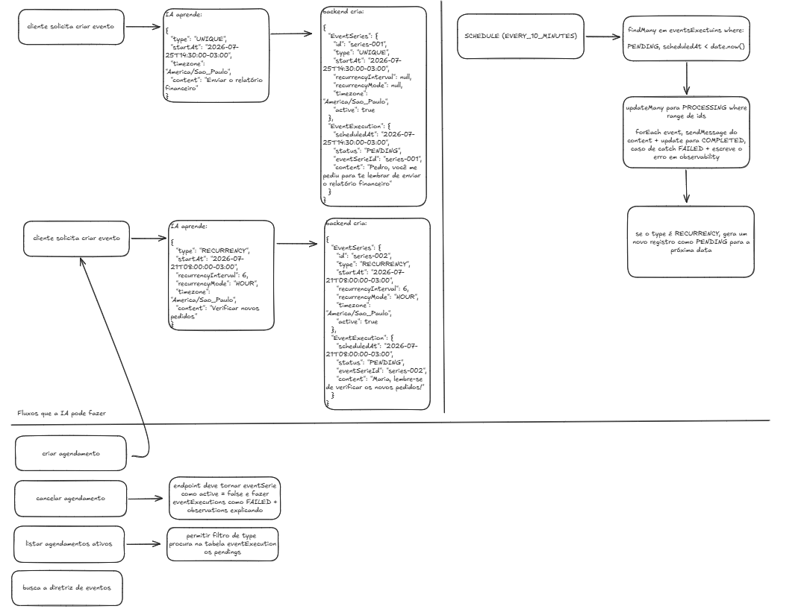

# Events module

Este módulo cria e executa mensagens agendadas para um `Profile`. A série guarda
a regra do evento; cada execução guarda um disparo concreto, seu estado e o
resultado do envio.

## Diagrama



## Modelo e regras

- `EventSeries` pertence a um `Profile`, tem tipo `UNIQUE` ou `RECURRENCE`.
- O timezone IANA pertence ao `Profile` e tem `America/Sao_Paulo` como padrão.
- `EventExecution` contém o conteúdo a enviar, `scheduledAt`, estado e o campo
  `observabilitys` para o motivo da falha.
- Estados: `PENDING`, `PROCESSING`, `COMPLETED`, `FAILED` e `CANCELLED`.
- Toda data agendada é arredondada ao intervalo de 10 minutos mais próximo. Em
  caso de empate, arredonda para frente.
- Eventos recorrentes exigem `recurrenceInterval` positivo e `recurrenceMode`
  (`HOUR`, `DAY`, `WEEK` ou `MONTH`). Após sucesso ou falha, a schedule cria a
  próxima ocorrência estritamente futura.
- Ao terminar um evento `UNIQUE`, sua série fica inativa. Ao deletar uma série,
  ela fica inativa e todas as execuções pendentes passam para `CANCELLED`.

## Endpoints

### `POST /events-m2m/events`

Cria uma série e a primeira execução `PENDING`.

```json
{
  "profileId": "uuid",
  "type": "RECURRENCE",
  "startAt": "2026-07-25T09:05:00-03:00",
  "content": "Verificar novos pedidos",
  "recurrenceInterval": 1,
  "recurrenceMode": "HOUR"
}
```

Para `UNIQUE`, não envie `recurrenceInterval` nem `recurrenceMode`. A resposta
é `{ "eventSeries": {}, "eventExecution": {} }`.

### `DELETE /events-m2m/events/:eventSeriesId`

Desativa a série e cancela suas pendências. Retorna a série e
`cancelledExecutions`.

### `GET /events-m2m/events`

Lista apenas execuções `PENDING` ou `PROCESSING` de séries ativas.

- `profileId=uuid` é obrigatório e restringe a consulta ao perfil.
- `scheduledAt=YYYY-MM-DD` é opcional e filtra o dia calendário no fuso do
  perfil.
- `type=UNIQUE|RECURRENCE` é opcional e pode ser combinado com a data.

### `GET /events-m2m/guideline`

Retorna uma diretriz textual básica para a IA estruturar requisições de evento.

## Scheduler

`EventsSchedule` roda a cada 10 minutos. Ele busca pendências vencidas de
séries ativas, reserva-as como `PROCESSING`, envia o conteúdo para o `jid` do
perfil, persiste `COMPLETED` ou `FAILED` e registra falhas em `observabilitys`.
Não há retentativa automática nesta versão.
